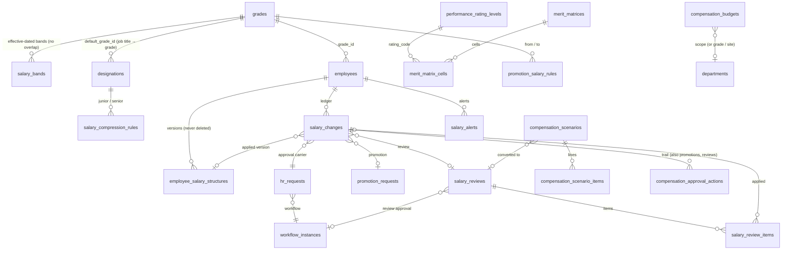

# Compensation & Salary Management

Annual increments, promotions, adjustments and corrections, grades and effective-dated salary bands, employee
band positioning, merit recommendations, approval chains, budgets, scenario planning, salary history, alerts,
dashboards, reports and the audit trail. **Every company policy value is configuration** — bands, thresholds,
percentages, rating levels, merit matrix, eligibility rules, promotion and compression rules, budgets and approval
chains. The seeded values are development examples marked **REQUIRES HR / FINANCE CONFIRMATION**.

## 1. Architecture — how the module fits Burtplace Workforce

The module extends what already existed instead of running beside it:

| Need | Reused | Added |
|---|---|---|
| Grades / job title → grade | `grades`, `designations.default_grade_id` | grade description/notes/status/soft delete; `salary_bands` (effective-dated history) — `grades.min/mid/max` stays as the *current-band cache* for older screens |
| Salary & salary history | versioned `employee_salary_structures` + lines | `salary_changes` — the compensation ledger: one row for **every** salary version, whatever path created it |
| Business actions with approval | `hr_requests` + `applyHrRequest`, generic workflow engine (`workflow_definitions / instances / tasks`), delegation, approvals inbox | approval chains `COMP_<TYPE>`; `statusOnApprove` per step; `compensation_approval_actions` (role + previous → new status, immutable) |
| Annual review | `increment_cycles` / `increment_entries` | renamed to `salary_reviews` / `salary_review_items` and extended (eligibility, merit, ceiling, budget, workflow). The old `/increment-cycles` endpoints are replaced by `/compensation/reviews` — they applied increases with no band check |
| Performance | `performance_cycles / reviews.final_rating` (1–5) | `performance_rating_levels` (score → named rating), `merit_matrices` + cells |
| Audit | immutable `audit_logs` (user, time, old/new, IP, approval ref) | `app.audit(…, executor)` writes inside the caller's transaction; `/compensation/audit` view |
| Settings | `app_settings` + history (versioned) | key `compensation.policy` (thresholds, band basis, ceiling actions, budget enforcement, segregation of duties…) |
| Reports / export | CSV export pattern of `/reports` | 12 compensation reports (`/compensation/reports/:key?format=csv`) |
| Jobs | BullMQ scheduler | `compensation.alerts.scan` daily at 06:45 |

Key decisions:

1. **The CLAUDE.md HR-OS rule holds**: a salary never changes from a UI action. Each compensation change is a
   `salary_changes` row (DRAFT) → on submit an `hr_requests` row (INCREMENT / SALARY_CHANGE / PROMOTION / new
   GRADE_CHANGE) on workflow `COMP_<CHANGE_TYPE>` → approvals → `applyHrRequest` creates the salary version.
2. **Never auto-approved.** Compensation submissions use `requireWorkflow`: when no approval step would run the
   request is refused (422) instead of being auto-applied (the generic HR-request default).
3. **One transaction on final approval** (`applyCompensationRequest`): validate employee → band (never above max
   without an approved exception) → duplicate → stale salary (salary changed since the request?) → budget →
   recompute salary lines → apply the HR request (salary version, employment history, timeline) → complete the ledger
   row → approval trail → audit. Any failure rolls everything back; the request becomes FAILED with the reason and
   can be re-applied after the cause is fixed.
4. **Reviews are approved as a whole** (1,000 employees ≠ 1,000 approval chains). On final approval every item is
   applied in its own transaction (idempotent, resumable: completed items are skipped, failures are listed and retried
   via `POST /reviews/:id/complete`). A review-wide budget check runs before any item is applied.
5. **Band basis is configurable** (`BASIC` default, or `GROSS`). For GROSS the fixed earnings are scaled and the
   rounding remainder goes to BASIC, so the new gross equals the target exactly — rounding can never exceed the maximum.
6. **Profiles are computed, not stored.** The "employee compensation" record is one SQL query with lateral joins
   (current structure, band in force, last increase/promotion/review, latest rating, disciplinary, annual increments)
   plus the pure engine for the metrics — no denormalised table to drift. Fast enough for thousands of employees.
7. **Salary visibility** is separate from module access: `compensation:read` gives the module and aggregate counts;
   individual amounts always need `salary:read`. The System Administrator (IT_ADMIN) gets only `compensation:settings`.

## 2. Data model (migration `0015_compensation_management.sql`)

Integrity rules enforced **in the database**:

| Rule | Mechanism |
|---|---|
| min ≤ mid ≤ max, max > 0 | `salary_bands_order_chk` |
| one active band per grade and date | `EXCLUDE USING gist (grade_id, daterange)` (btree_gist) |
| one live annual increase per employee and year | partial unique index `salary_changes_one_annual_increment` (authorised `duplicate_override` rows excepted) |
| overrides need a justification | `salary_changes_justification_chk` |
| salary history never deleted | `salary_changes_guard` (no DELETE; COMPLETED/REJECTED/CANCELLED rows frozen) + `employee_salary_structures_no_delete` |
| approval trail immutable | `compensation_approval_actions_immutable` (like `audit_logs`) |
| budget scope consistent | `compensation_budgets_scope_chk`; unique budget per year/type/scope |
| review / item / change statuses | CHECK constraints |

Soft delete: grades, bands (`RETIRED` + `deleted_at`), merit matrices, budgets, scenarios, reviews.

## 3. Calculation engine (`packages/core/src/compensation.ts`, pure & unit-tested)

| Function | Formula / behaviour |
|---|---|
| `bandPosition` | compa-ratio = salary / mid × 100; range penetration = (salary − min) / (max − min) × 100; remaining = max − salary (≥ 0); max possible increase % = (max − salary) / salary × 100 (≥ 0) |
| `classifyBandStatus` | below min → `belowMin`; above max → `aboveMax`; exactly max → `atMax`; else the configured range `[fromPct, toPct)` (unrounded penetration) |
| `calculateIncrease` | % / amount / new salary → proposed; above max ⇒ **ACTION_REQUIRED** with “Proposed salary exceeds the maximum salary band by AED X.” until a policy-allowed action is chosen: `CAP_AT_MAX`, `REQUEST_EXCEPTION`, `CANCEL`, `CHANGE_GRADE`; alerts for max-% breach, decrease, below min, missing band |
| `resolveRatingLevel`, `recommendMeritIncrease` | score → rating level; rating × compa range `[min, max)` → recommended / maximum % |
| `selectPromotionRule`, `calculatePromotionSalary` | most specific rule; methods `PERCENT_INCREASE`, `TO_MINIMUM`, `TO_MIDPOINT`, `PERCENT_OF_MIDPOINT`, `FIXED_AMOUNT`, `GREATER_OF_PERCENT_OR_MINIMUM`, min/max increase clamps, cap at target max; alerts below min / above max / lower than current |
| `evaluateEligibility` | service months, months since last increase, last-increase-before date, statuses, employment types, min score / rating codes, disciplinary window, probation, department / grade / site / title scope — returns every failing reason |
| `budgetUsage`, `checkBudget`, `annualCost` | proposed = pending + approved + completed; approved = approved + completed; remaining = allocated − proposed |
| `runScenario` | flat %, merit matrix, promotion + increment, budget-limited (binary-search scale factor so the annual cost fits the limit despite caps) |
| `detectCompression` | average / median / max-junior-vs-min-senior difference below amount or % → “Potential Salary Compression”; inversions flagged |
| `distributeToTotal` | scale fixed earnings to an exact gross (remainder on BASIC) |
| `findDuplicateAnnualIncrease` | employee + year, ignoring rejected / cancelled / failed |

## 4. Change types & workflow

`ANNUAL_INCREMENT`, `PROMOTION`, `MARKET_ADJUSTMENT`, `SALARY_CORRECTION`, `MERIT_INCREASE`, `SPECIAL_ADJUSTMENT`,
`DEMOTION_ADJUSTMENT`, `GRADE_CHANGE` (+ `JOINING` for the first salary). Every change stores type, old salary,
increase amount and %, new salary, effective date, reason, comments, justification, requested by, approved by and
approval date, band snapshot, compa before/after, ceiling action and override flags.

Statuses: `DRAFT → SUBMITTED → UNDER_REVIEW → HR_APPROVED → FINANCE_APPROVED → MANAGEMENT_APPROVED → COMPLETED`, or
`REJECTED`, `CANCELLED`, `FAILED`. The status after each step comes from the step's `statusOnApprove` (or its role).
Each decision writes `compensation_approval_actions` (user, role, date, action, comment, previous → new status) and an
audit row. **Segregation of duties** (policy): the preparer / submitter cannot approve their own request.

Seeded chains (edit in *Compensation → Settings → Approval chains*, versioned):

| Code | Steps |
|---|---|
| COMP_ANNUAL_INCREMENT | HR Manager → Finance Manager → Management *(only when `requiresException`)* |
| COMP_MERIT_INCREASE, COMP_PROMOTION, COMP_SPECIAL_ADJUSTMENT | HR Manager → Line manager → Finance Manager → Management |
| COMP_MARKET_ADJUSTMENT, COMP_GRADE_CHANGE | HR Manager → Finance Manager → Management |
| COMP_SALARY_CORRECTION | HR Manager → Finance Manager |
| COMP_DEMOTION_ADJUSTMENT | HR Manager → Line manager → Management |
| COMP_SALARY_REVIEW (whole cycle) | HR Manager → Finance Manager → Management |

Workflow context available to step conditions: `changeType, requiresException, exceedsMaxBy, annualCost,
increasePct, increaseAmount, isOverride` (changes) and `employees, annualCost, exceptions, requiresException,
averagePct` (reviews) — e.g. “Management only above AED 50,000 annual cost”.

Other legacy paths are covered too: generic HR requests that create a salary version and `POST /employees/:id/salary`
write a ledger row (`HR_REQUEST` / `DIRECT`, direct later edits flagged `outside_workflow` and alerted); duplicate
protection applies to them as well. Policy `directSalaryEntry = INITIAL_ONLY` restricts direct entry to the joining salary.

## 5. API (`/api/v1/compensation`, Zod-validated, documented at `/docs`)

| Area | Endpoints |
|---|---|
| Structure | `GET/POST /grades`, `PUT/DELETE /grades/:id`, `GET/POST /salary-bands`, `PUT/DELETE /salary-bands/:id`, `GET /grade-check`, `GET /job-grade-mappings`, `PUT /job-grade-mappings/:designationId` |
| Configuration | `GET/PUT /rating-levels`, `GET/POST /merit-matrices`, `PUT/DELETE /merit-matrices/:id`, `GET/POST /promotion-rules`, `PUT /promotion-rules/:id`, `GET/POST /compression-rules`, `PUT /compression-rules/:id`, `GET/PUT /settings/policy`, `GET /settings/policy/history`, `GET /settings/workflows`, `PUT /settings/workflows/:code` |
| Employees | `GET /employees` (filters, sorting), `GET /employee/:id` (profile, history, changes, promotions, approvals, alerts, allowed actions), `GET /employee/:id/history` |
| Changes | `POST /increments/calculate` = `POST /changes/calculate`, `POST /increments`, `POST /changes`, `GET /changes`, `GET /changes/:id`, `POST /changes/:id/submit`, `/cancel`, `/approve` (= `POST /increments/:id/approve`) |
| Promotions | `POST /promotions/calculate`, `POST /promotions`, `GET /promotions`, `GET /promotions/:id`, `POST /promotions/:id/submit`, `/cancel`, `/approve` |
| Reviews | `GET/POST /reviews`, `GET/PUT /reviews/:id`, `POST /reviews/:id/populate`, `GET/PATCH /reviews/:id/items`, `POST /reviews/:id/bulk-ceiling`, `/submit`, `/approve`, `/complete`, `/cancel`, `/reopen` |
| Planning | `GET/POST /budgets`, `PUT/DELETE /budgets/:id`, `GET/POST /scenarios`, `GET /scenarios/compare?ids=`, `GET /scenarios/:id`, `GET /scenarios/:id/items`, `POST /scenarios/:id/calculate`, `POST /scenarios/:id/convert`, `DELETE /scenarios/:id` |
| Insights | `GET /dashboard`, `GET /analysis?groupBy=department|site|grade|designation|employmentType|gender|status`, `GET /alerts`, `POST /alerts/scan`, `POST /alerts/:id/acknowledge`, `GET /compression`, `GET /approvals/pending`, `GET /reports`, `GET /reports/:key?format=csv`, `GET /audit` |
| Pay items (unchanged) | `/deductions`, `/bonuses`, `/loans` |

Approvals can also be decided from the general approvals inbox (`/workflows/tasks/:id/decide`) — same hooks.

## 6. Frontend (`apps/web/src/app/compensation`)

`/compensation` dashboard · `/compensation/employees` + `/employees/[id]` (the employee compensation page with the
band bar, quick what-if and ceiling decision) · `/compensation/changes/[id]` · `/compensation/salary-structure` ·
`/compensation/reviews` + `/reviews/[id]` · `/compensation/promotions` · `/compensation/budgets` ·
`/compensation/scenarios` · `/compensation/alerts` · `/compensation/reports` · `/compensation/settings` ·
`/compensation/pay-items` (loans, bonuses, deductions). Shared pieces live in `components/compensation/common.tsx`
(status pills 🟢🟡🟠🔴🔵, `BandBar`, `CeilingDecision`, `SalaryChangeModal`, `PromotionModal`, `ApprovalTrail`).
The employee profile's *Promote* / *Change salary* actions open the compensation dialogs.

Dashboard: total employees, monthly payroll, average and median salary, increment / promotion budgets with
utilisation, approved increase cost, pending approvals; alert chips (above max, near max, below min, pending,
eligible for review); band-status mix; salary distribution; payroll growth (12 months); average salary by grade vs
band; by department and site; above-maximum and near-ceiling lists; items waiting for my decision. Without
`salary:read` the page shows counts only.

## 7. Reports (JSON preview, CSV export — opens in Excel; every run is audited)

Salary register · Annual increments · Promotions · Salary bands · Above maximum · Below minimum · Salary ceiling ·
Compensation budgets · Department salary analysis · Salary history · Pending approvals · Compensation change audit.

## 8. Permission matrix

New permissions: `compensation:propose`, `compensation:config`, `compensation:settings`, `compensation:override`,
`compensation:budget`, `reports:compensation`. Existing: `compensation:read` (module + aggregates), `salary:read`
(individual amounts), `salary:write` (retry review completion), `workflows:act` (approve), `audit:read`.

| Role | read | salary amounts | propose / submit | approve (by chain) | override | config | settings | budget | reports |
|---|---|---|---|---|---|---|---|---|---|
| COMPENSATION_OFFICER (*HR Officer — Compensation*, new) | ✓ | ✓ | ✓ | – | – | – | – | – | ✓ |
| HR_ADMIN | ✓ (counts) | – | – | step `HR_ADMIN` if configured | – | – | – | – | – |
| HR_MANAGER | ✓ | ✓ | ✓ | HR step | ✓ | ✓ | ✓ | ✓ | ✓ |
| DEPARTMENT_MANAGER / PROJECT_MANAGER | – | – | – | line-manager step | – | – | – | – | – |
| FINANCE | ✓ | ✓ | – | if configured | – | – | – | – | ✓ |
| FINANCE_MANAGER | ✓ | ✓ | – | Finance step | – | – | – | ✓ | ✓ |
| MANAGEMENT | ✓ | ✓ | – | Management step | – | – | – | – | ✓ |
| PAYROLL_OFFICER | ✓ | ✓ | – | – | – | – | – | – | ✓ |
| IT_ADMIN (System Administrator) | – | – | – | – | – | – | ✓ (no amounts) | – | – |
| AUDITOR | ✓ | ✓ (read) | – | – | – | – | – | – | ✓ |
| SUPER_ADMIN (break-glass) | everything | | | | | | | | |

Segregation of duties is enforced regardless of role (policy `segregationOfDuties`).

## 9. Audit strategy

- Every mutation calls `app.audit` (user, timestamp, action, record, old value, new value, reason, IP, user agent,
  approval ref); inside the salary transaction the audit row is written with the same transaction.
- Actions: `compensation.change.create|submit|approve|reject|cancel|completed|failed`, `compensation.promotion.*`,
  `compensation.review.*`, `compensation.band.create|update|retire`, `compensation.grade.*`, `compensation.mapping.update`,
  `compensation.matrix.*`, `compensation.promotion_rule.*`, `compensation.compression_rule.*`, `compensation.policy.update`,
  `compensation.workflow.update`, `compensation.budget.*`, `compensation.scenario.*`, `compensation.alert.acknowledge`,
  `compensation.report.run`, plus `hr_request.<type>.applied` and `employee.salary.update`.
- `audit_logs` and `compensation_approval_actions` are immutable (triggers); policy versions live in `app_settings_history`.
- `GET /compensation/audit` and the *Compensation change audit* report filter this trail; values are masked for users
  without `salary:read`.

## 10. Tests

- `packages/core/test/compensation.test.ts` (40): salary exactly at min / mid / max, above max, 7,800 → 93.3 % / 120 %,
  threshold boundaries, custom thresholds, 10 % exceeding the maximum by AED 250, cap / exception / cancel / change
  grade, merit matrix boundaries, promotion rules incl. promotion into a lower salary, eligibility, budget maths,
  scenarios (flat, merit, budget-limited, promotion + increment), compression and inversion, duplicate rules, exact
  gross distribution.
- `apps/api/test/compensation.test.ts` (26): band validation & overlap, profile metrics, salary visibility (employee,
  HR_ADMIN, IT_ADMIN), ceiling alert and blocked submission, full HR → Finance chain with the exact approval trail
  and audit entries, duplicate increment (403 officer / 422 without justification / DB unique index), immutability
  triggers, band exception with the conditional Management step, segregation of duties, rejected review, override
  rules, promotion (rule-based salary, 4-step chain, grade + salary applied), budget exceeded, review cycle
  (ineligible / action required / override / bulk cap / approval / atomic completion), cancelled review, scenarios
  (compare, salaries untouched, convert), dashboard, analysis, alert scan & auto-resolve, CSV reports, policy
  versioning, refusal to auto-approve when no chain is configured.
- `apps/api/test/hr-os.test.ts`: the former increment-cycle test now runs through the salary review API.

Run: `pnpm --filter @burtplace/core test` and `pnpm --filter @burtplace/api test`.

## 11. Development seed (`packages/database/src/seed-compensation.ts`)

Bands for every seeded grade (from G1–G10), rating levels over the 1–5 scale, a default merit matrix, a default
promotion rule (greater of 10 % or the target minimum, +5 % … +25 %, capped), compression rules (adjacent grades 5 %;
Charge Hand → Foreman; Site Engineer → Construction Manager), the policy, FY 2027 budgets (annual 5 M, increment 3.5 M,
promotion 1 M, adjustment 0.5 M AED), the nine approval chains and the `comp.officer@burtplace.local` user
(password `Password123!`). All values are examples.

## 12. Rollout plan

1. Deploy migration 0015 (renames increment cycles; backfills bands from existing grade min/mid/max).
2. HR / Finance confirm and replace the examples: bands per grade, status thresholds, rating levels, merit matrix,
   promotion and compression rules, approval chains; tick *signed off* in the policy.
3. Map every job title to a grade and fill missing employee grades (*Salary structure → Job title → grade*);
   clear the *Grade missing / Band missing / No salary structure* alerts.
4. Define the fiscal-year budgets; decide `budgetEnforcement` and `directSalaryEntry` (recommend `INITIAL_ONLY`
   once data is clean).
5. Assign roles: COMPENSATION_OFFICER to HR officers preparing changes; confirm who holds `salary:read`.
6. Run scenarios for the coming review, convert the chosen one, walk it through approval; individual changes and
   promotions use the same chains.
7. Worker running → daily alert scan; review the dashboard alerts weekly.

## 13. Requires confirmation

| Item | Owner |
|---|---|
| Band values, band basis (basic vs gross), thresholds | HR — **REQUIRES HR CONFIRMATION** |
| Merit matrix, rating levels, promotion rules, compression rules | HR |
| Budgets, annualisation months, budget enforcement | Finance — **REQUIRES FINANCE CONFIRMATION** |
| Approval chains and exception routing | HR + Management |
