# Data model

Migrations live in `packages/database/migrations` (SQL, applied in order by `pnpm db:migrate`). 70+ tables; the core relationships:

```mermaid
erDiagram
  users ||--o{ user_roles : has
  roles ||--o{ user_roles : grants
  roles ||--o{ role_permissions : has
  permissions ||--o{ role_permissions : in
  users ||--o{ api_keys : owns
  users ||--o| employees : "login for"

  departments ||--o{ employees : ""
  designations ||--o{ employees : ""
  sites ||--o{ employees : ""
  projects ||--o{ employees : ""
  projects ||--o{ sites : ""
  cost_centers ||--o{ projects : ""
  employees ||--o{ employees : manages

  employees ||--o{ employee_status_history : ""
  employees ||--o{ employment_history : ""
  employees ||--o{ employee_documents : ""
  employees ||--o{ employee_contracts : ""
  employees ||--o{ employee_salary_structures : "versions"
  employee_salary_structures ||--o{ employee_salary_lines : ""
  salary_components ||--o{ employee_salary_lines : ""

  devices ||--o{ attendance_raw_events : reports
  employees ||--o{ biometric_mappings : "external ids"
  employees ||--o{ attendance_raw_events : "resolved to"
  attendance_raw_events ||--o| attendance_events : "processed as"
  attendance_corrections ||--o| attendance_events : "adds"
  employees ||--|{ attendance_daily : "one per day"
  shifts ||--o{ attendance_daily : ""
  attendance_daily ||--o{ attendance_exceptions : ""

  shifts ||--o{ work_patterns : default
  work_patterns ||--o{ shift_assignments : ""
  shifts ||--o{ shift_assignments : ""
  employees ||--o{ shift_assignments : "exception"
  sites ||--o{ shift_assignments : "default"

  leave_types ||--o{ leave_policies : ""
  leave_types ||--o{ leave_balances : ""
  employees ||--o{ leave_balances : ""
  leave_balances ||--o{ leave_balance_transactions : ""
  employees ||--o{ leave_requests : ""
  leave_requests ||--o{ attendance_daily : "marks"

  overtime_rules ||--o{ overtime_requests : ""
  employees ||--o{ overtime_requests : ""
  attendance_daily ||--o| overtime_requests : ""

  employees ||--o{ timesheets : monthly
  timesheets ||--|{ timesheet_lines : ""
  attendance_daily ||--o| timesheet_lines : ""

  payroll_policies ||--o{ payroll_runs : ""
  payroll_runs ||--|{ payroll_employees : ""
  timesheets ||--o| payroll_employees : ""
  employee_salary_structures ||--o{ payroll_employees : snapshot
  payroll_employees ||--o{ payroll_earnings : ""
  payroll_employees ||--o{ payroll_deductions : ""
  payroll_employees ||--o| payslips : ""
  employees ||--o{ payroll_adjustments : ""
  employees ||--o{ employee_loans : ""

  workflow_definitions ||--o{ workflow_instances : ""
  workflow_instances ||--|{ workflow_tasks : ""
  users ||--o{ notifications : ""
  checklist_templates ||--o{ checklist_instances : ""
  checklist_instances ||--|{ checklist_tasks : ""
  assets ||--o{ employee_assets : ""
  integration_connections ||--o{ integration_logs : ""
  integration_connections ||--o{ integration_failures : ""
  migration_batches ||--|{ migration_rows : ""
```

## Conventions

- `uuid` primary keys (`gen_random_uuid()`), `bigserial` for append-only logs.
- `created_at/updated_at` (trigger-maintained), `deleted_at` soft deletes on master data.
- Enums are PostgreSQL enum types mirrored in `@burtplace/types`.
- Money: `numeric(14,2)`; rates `numeric(14,4)`; minutes as `integer`.
- Timestamps `timestamptz` (UTC); business dates `date`; shift times `time` interpreted in `shifts.timezone`.
- Immutable: `attendance_raw_events` (only `processed_at`, `processing_error`, late `employee_id` mapping may change), `audit_logs`.
- Views: `v_employee_directory`, `v_document_expiry`.
